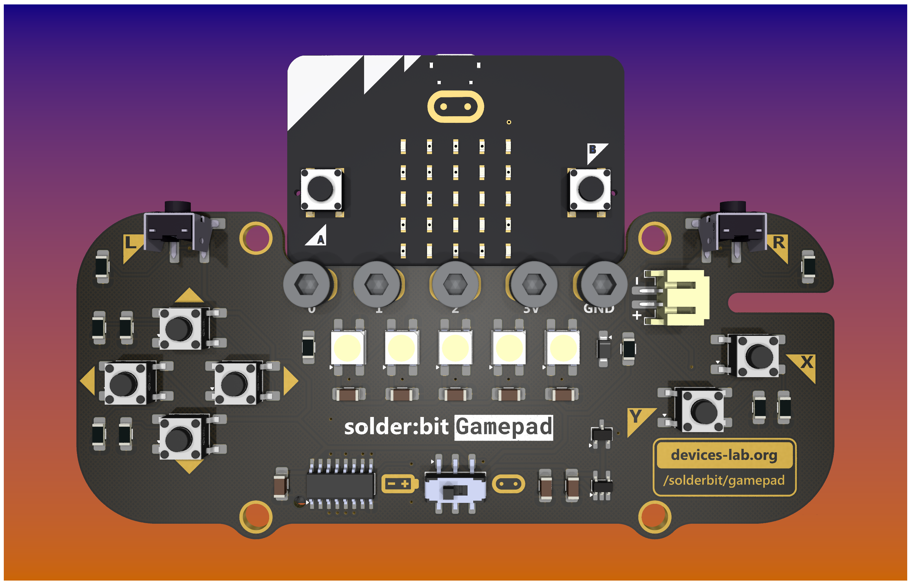

# solder:bit Gamepad for the BBC micro:bit

The solder:bit Gamepad originated as a workshop idea for the upcoming [Device prototyping and production summer school](https://prosquared.org/event/2024-summer-school/) held at Lancaster University. Designed primarily to introduce participants to the fundamentals of surface mount soldering, this project not only demystifies a key skill in electronics but also integrates the fun and educational platform of the BBC micro:bit.

## Project status

The solder:bit Gamepad is currently in the development stage, undergoing testing with version 0.7 prototype. We are refining the design to ensure it meets our educational objectives and user expectations.

See [CHANGELOG.md](/CHANGELOG.md) for the latest pre-release versions and changes.

## Getting started

There are two ways to get started with the solder:bit Gamepad, depending on whether you already have the necessary parts or if you prefer to generate and order the components yourself.

### Starting with the bare PCB kit

If you already have the bare PCB and all the required components listed in the [bill of materials (BOM)](#bill-of-materials-bom), follow these steps to get your gamepad up and running:

1. **Soldering and assembly**: a guide will be released soon.
2. **Programming**: an extension for MakeCode is planned.

### Generating and ordering PCB

If you prefer to generate the fabrication files yourself and order it from a PCB house, follow these steps:

1. **Gerber files and ordering**: See [this](#generating-gerber-files-and-ordering-pcbsw) section below.
2. **Ordering**: Submit fabrication files to a PCB manufacturer of your choice.

Once you receive the PCB and components, proceed with assembly and programming.

## Bill of materials (BOM) for v0.7

| Designator                     | Description                  | Quantity | LCSC Part |
| ------------------------------ | ---------------------------- | -------- | --------- |
| BT1                            | Battery holder               | 1        | C964881   |
| C1, C2, C3, C4, C5, C6, C7, C8 | 1 uF capacitors              | 8        | C1848     |
| D1, D2, D3, D4, D5             | NeoPixels                    | 5        | C2843785  |
| D6                             | Schottky diode               | 1        | C223608   |
| J2                             | Connector                    | 1        | C295747   |
| Q1                             | MOSFET                       | 1        | C459541   |
| R1, R2, R3, R4, R5, R6, R7, R8 | 100k Ohm resistors           | 8        | C17900    |
| R9                             | 300 Ohm resistor             | 1        | C17887    |
| R10                            | 3 Ohm resistor               | 1        | C17939    |
| S1, S2, S3, S4, S5, S6         | Tactile switches             | 6        | C2837532  |
| S7, S8                         | Right-angle tactile switches | 2        | C499324   |
| SW1                            | Sliding switch               | 1        | C2906280  |
| U1                             | PISO shift register          | 1        | C5613     |
| U2                             | Voltage regulator            | 1        | C457666   |

## Generating Gerber files and ordering PCBs

Gerber files are the standard file format used in the electronics industry to communicate design information to PCB manufacturers. They contain all the necessary details for producing printed circuit boards (PCBs), including copper layering, solder mask, silkscreen, and drill data. Essentially, Gerber files serve as the blueprint for your PCB, ensuring that the manufacturer can accurately reproduce your design. Each file represents a single layer of the PCB, such as the top copper layer, bottom copper layer, or solder mask layer. Using this standard allows designers to convey precise and clear instructions to virtually any PCB manufacturer worldwide.

### Using KiCad (version 9 or newer)

Generating Gerber files is a crucial step in the PCB manufacturing process. If you are using KiCad version 7 or newer, follow these general steps to generate your Gerber and drill files:

1. **Select the project version.** Clone this repo and select the version of the device you would like to generate Gerber files for (we recommend the latest version).
2. **Check the design rules.** Confirm that your PCB design complies with the design rules of your chosen PCB manufacturer.
3. **Generate Gerber and drill files.** Select 'Gerbers (.grb)...' option in the 'File' menu under 'Fabrication Outputs'. Select the layers you need and make sure the formats match the requirements of your PCB manufacturer. Ensure to plot the drill files, as well as the drill map file if required by your fabrication house.
4. **Verify the files.** Use a Gerber viewer tool (such as [Tracespace](https://tracespace.io)) to check the files before sending them to the manufacturer to avoid any potential issues.

A detailed guide on how to export these files from KiCad can usually be found in the documentation or help section of your PCB design software or on online electronics forums and resources.

### Using pre-made Gerber files

If you prefer not to generate your own files, we have provided ready-to-use Gerber files in the `fabrication` folder of this repository. These files are designed to meet general specifications required by most PCB manufacturers. To use them:

1. **Download the Gerber files** from the `fabrication` folder. Inside, you'll find separate subfolders labeled for different manufacturers, such as Eurocircuits and JLCPCB. These files are identical to the ones we sent to the respective fabrication houses.
2. **Upload the files to the PCB manufacturer's website** when placing your order. Be sure to review any specific requirements or settings that your chosen manufacturer may require to ensure proper fabrication of your PCB.

This flexibility allows you to either use a direct approach with pre-made files or customize the process by generating your own files, fitting your level of expertise and specific needs.

## Credits

Special thanks to everyone at the Lancaster University [Devices Lab](https://www.devices-lab.org/).

## License

This project is licensed under the GNU General Public License (GPL), version 3. This license allows you to use, modify, and redistribute the solder:bit Gamepad and any derivative works, but all such derivatives must also be licensed under the GPL.

The GPL ensures that all modifications and improvements to the solder:bit Gamepad remain free and open for the public benefit. By using this project, you agree to abide by its terms and conditions.

For more details on the license, please see the [LICENSE](/LICENSE.txt) file included in this repository.
