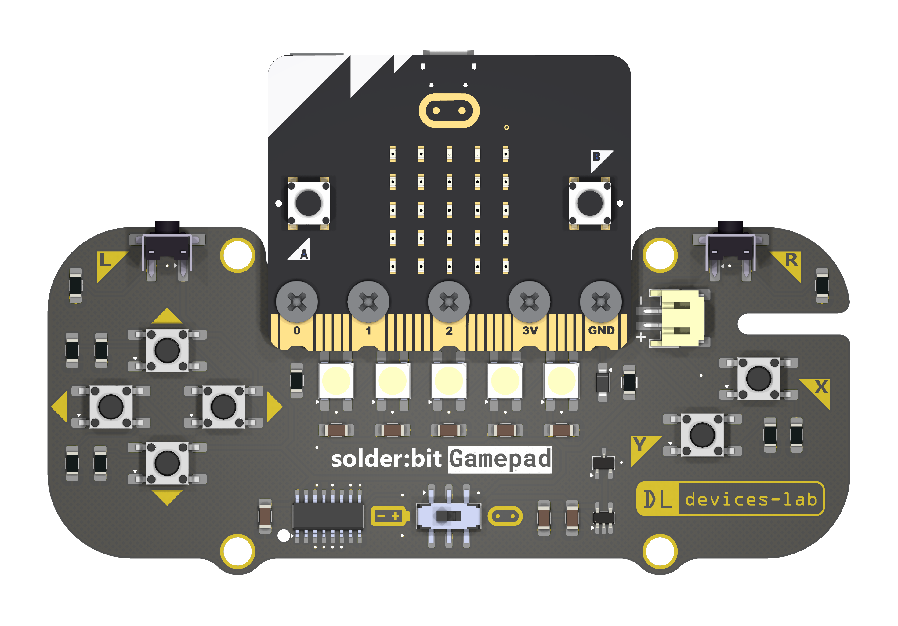

# solder:bit Gamepad for the BBC micro:bit

The solder:bit Gamepad kit is designed to teach PCB assembly using surface-mount technology (SMT) to users of various abilities, including novices. Once assembled, the device functions as a gamepad that connects to a BBC micro:bit.

## Project status

See [CHANGELOG.md](/CHANGELOG.md) for the latest pre-release versions and changes.

## Credits

Special thanks to everyone at the Lancaster University [Devices Lab](https://www.devices-lab.org/).

## License

This project is licensed under the GNU General Public License (GPL), version 3. This license allows you to use, modify, and redistribute the solder:bit Gamepad and any derivative works, but all such derivatives must also be licensed under the GPL.

The GPL ensures that all modifications and improvements to the solder:bit Gamepad remain free and open for the public benefit. By using this project, you agree to abide by its terms and conditions.

For more details on the license, please see the [LICENSE](/LICENSE.txt) file included in this repository.
