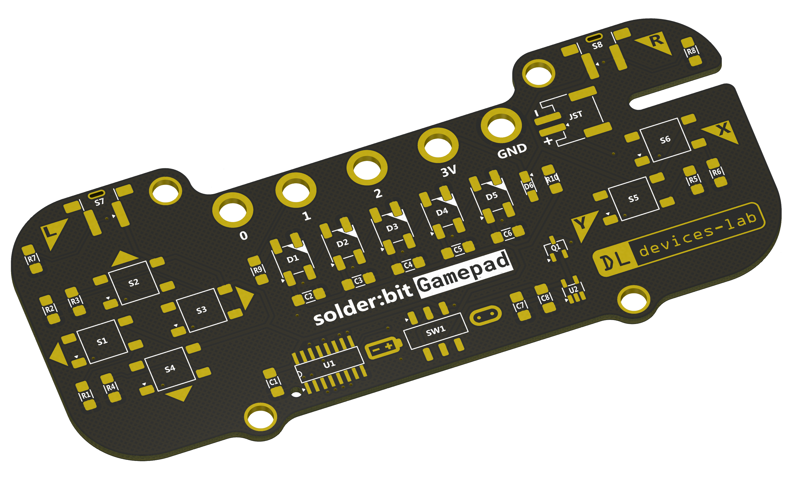
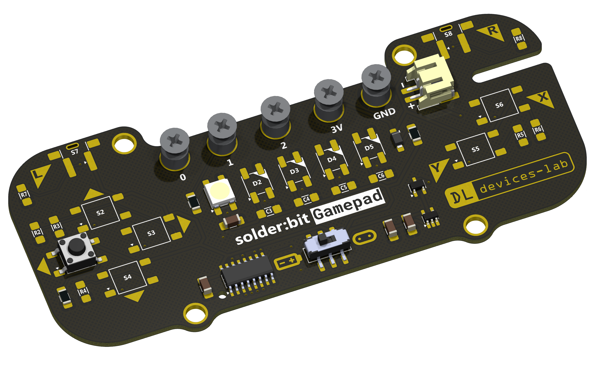

# solder:bit Gamepad

The solder:bit Gamepad is a kit for learning to solder with surface-mount (SMT) components. When assembled, the device functions as a gamepad that connects to a BBC micro:bit. You can then program it as the input controls for any micro:bit project you create!

This soldering kit is designed to accommodate a wide range of soldering abilities, from complete novices to more experienced solderers. To support this, the kit comes in two variants:

### Bare PCB

You start with just the printed circuit board (PCB) and solder all of the components yourself. Some components are small, making for a fun challenge for those up to the task!

### Partially-assembled PCB

This variant comes with some of the smaller components already pre-soldered. All components required for the device to function, including the power protection circuitry, are pre-placed. One button and one LED are also pre-soldered. Your task is to solder the remaining components.

The solder:bit Gamepad is a great device for teaching soldering at workshops and events where participants have varying ability levels. The partially-assembled PCB is ideal for novices because there are still plenty of larger components to solder. More experienced participants can take on the challenge of assembling the smaller components. Having everyone work on the same device also means the instructor only needs to guide the group through one assembly process, and everyone walks away with the same result.

## Getting started

To get started, you will need the following:

1. The printed circuit boards (PCBs), which you will need to have manufactured.
2. All components listed in the bill of materials (BOM).
3. A BBC micro:bit and a battery pack.
4. All equipment and materials required for soldering.

### Printed circuit boards (PCBs)

The solder:bit Gamepad fabrication files are open source, so you can order the PCBs yourself! You can choose to fabricate bare PCBs only, or have them partially assembled using a PCB assembly (PCBA) service.

> [!NOTE]
> PCBA services cost significantly more than fabricating bare PCBs and sourcing your own components. If you are running a workshop or event with only a few participants, it may be worth fabricating the bare PCBs and partially assembling them yourself.

To fabricate the **bare PCB**, use the files in the [gerbers-v0.8](/fabrication/gerbers-v0.8/) folder.

To fabricate the **partially-assembled PCB**, use the files in the [gerbers-v0.8-partial-assembly](/fabrication/gerbers-v0.8-partial-assembly/) folder. This contains the same Gerber files, along with the BOM, component position list (CPL) file, and a solder paste layer with paste only in the locations of the components for partial assembly.

> [!WARNING]
> The BOM and CPL files are formatted specifically for [JLCPCB](https://jlcpcb.com/), with all components sourced from [LCSC](https://www.lcsc.com/). If you need the fabrication files in a different format, you can export them from the [KiCad project files](/solderbit-gamepad-v0.8/).

### Components

> [!NOTE]
> Most of these components are sourced from [LCSC](https://www.lcsc.com/), but as they are fairly common components, alternatives can be found from other suppliers such as Farnell, CPC, DigiKey, and others.

For the **bare PCB** variant, you will need to source all of the components for the solder:bit Gamepad:

| Reference | Quantity | Part                  | Package                 | LCSC Part                                                     |
| --------- | -------- | --------------------- | ----------------------- | ------------------------------------------------------------- |
| C1–C8     | 8        | 1 µF \*               | 1206                    | [C1848](https://www.lcsc.com/product-detail/C1848.html)       |
| CN1–CN5   | 5        | SMTSOM310BTR          | SMD                     | [C2915635](https://www.lcsc.com/product-detail/C2915635.html) |
| D1–D5     | 5        | WS2812B               | SMD5050                 | [C2843785](https://www.lcsc.com/product-detail/C2843785.html) |
| D6        | 1        | MBR120VLSFT1G         | SOD-123FL               | [C223608](https://www.lcsc.com/product-detail/C223608.html)   |
| JST       | 1        | S2B-PH-SM4-TB(LF)(SN) | SMD, P=2mm, Right Angle | [C295747](https://www.lcsc.com/product-detail/C295747.html)   |
| Q1        | 1        | DMG2045U              | SOT-23                  | [C459541](https://www.lcsc.com/product-detail/C459541.html)   |
| R1–R8     | 8        | 100 kΩ \*             | 1206                    | [C17900](https://www.lcsc.com/product-detail/C17900.html)     |
| R9        | 1        | 300 Ω \*              | 1206                    | [C17887](https://www.lcsc.com/product-detail/C17887.html)     |
| R10       | 1        | 3 Ω \*                | 1206                    | [C17939](https://www.lcsc.com/product-detail/C17939.html)     |
| S1–S6     | 6        | KH-6X6X6H-STM         | SMD                     | [C2837532](https://www.lcsc.com/product-detail/C2837532.html) |
| S7–S8     | 2        | TS-1037-A4B3-D2       | SMD, 6×6mm              | [C499324](https://www.lcsc.com/product-detail/C499324.html)   |
| SW1       | 1        | MST22D18G2 125        | SMD                     | [C2906280](https://www.lcsc.com/product-detail/C2906280.html) |
| U1        | 1        | 74HC165D,653          | SOIC-16                 | [C5613](https://www.lcsc.com/product-detail/C5613.html)       |
| U2        | 1        | NCP114ASN330T1G       | TSOP-5-1.5mm            | [C457666](https://www.lcsc.com/product-detail/C457666.html)   |

_\* Generic component; the LCSC part number is provided as a reference, but any equivalent component in the same package can be substituted._

For the **partially-assembled PCB** variant, you only need to source the remaining components that are not pre-soldered:

| Reference | Quantity | Part            | Package    | LCSC Part                                                     |
| --------- | -------- | --------------- | ---------- | ------------------------------------------------------------- |
| C3–C6     | 4        | 1 µF \*         | 1206       | [C1848](https://www.lcsc.com/product-detail/C1848.html)       |
| D2–D5     | 4        | WS2812B         | SMD5050    | [C2843785](https://www.lcsc.com/product-detail/C2843785.html) |
| R2–R8     | 7        | 100 kΩ \*       | 1206       | [C17900](https://www.lcsc.com/product-detail/C17900.html)     |
| S2–S6     | 5        | KH-6X6X6H-STM   | SMD        | [C2837532](https://www.lcsc.com/product-detail/C2837532.html) |
| S7–S8     | 2        | TS-1037-A4B3-D2 | SMD, 6×6mm | [C499324](https://www.lcsc.com/product-detail/C499324.html)   |

_\* Generic component; the LCSC part number is provided as a reference, but any equivalent component in the same package can be substituted._

In either variant, the battery pack is attached to the back of the solder:bit Gamepad with adhesive hook-and-loop tape. You will need approximately 4 cm of 20 mm-wide tape, [like this one](https://www.amazon.co.uk/dp/B004XIKDLQ).

You may notice on back of the solder:bit Gamepad there are pads for an [SMT battery holder](https://www.lcsc.com/product-detail/C964881.html). If you would prefer to use this instead of attaching an external battery pack, you are welcome to do so.

### BBC micro:bit

You will need the following:

- micro:bit V2
- Micro-USB cable (for programming the micro:bit)
- Battery pack compatible with the micro:bit
- 2 × AAA batteries

The [BBC micro:bit Go](https://microbit.org/buy/bbc-microbit-go/) kit includes all of the above.

If you already have the micro:bit and a Micro-USB cable, you can purchase the [battery pack](https://microbit.org/buy/microbit-battery-pack/) and AAA batteries separately.

### Equipment and materials for soldering

The required equipment will vary depending on your soldering setup and needs, but the following is what you will generally need:

- Safety goggles
- Fume extractor fan
- Soldering iron
- Soldering iron stand
- Brass wool
- Silicone mat
- Solder
- Tweezers
- Solder wick

The following items are optional but useful:

- Blue Tack (for keeping the PCB in place)
- PCB holder/helping hands
- Flux
- Tip cleaner
- Desoldering pump
- Isopropyl alcohol (IPA) and cotton swabs
- Multimeter (for checking continuity in solder joints)

> [!CAUTION]
> To minimise health hazards, we recommend using lead-free and rosin-free solder and flux.

> [!TIP]
> If you are running this as a workshop/event activity, an [HDMI digital microscope](https://www.amazon.co.uk/dp/B09VPPS96M) connected to a display is very useful for streaming a soldering demonstration to the entire room.

> [!TIP]
> Smaller soldering iron tips make it easier to reach tight spaces, but they transfer heat less effectively. We recommend trying out a few different tip sizes and choosing one that works well with your soldering iron.

## Assembly instructions

Coming soon...

## Programming

You can program the solder:bit Gamepad in [MakeCode](https://makecode.microbit.org/) using the [pxt-solderbit-gamepad](https://github.com/devices-lab/pxt-solderbit-gamepad) extension.

You can test if your assembled device works by flashing the micro:bit with the [demo file](/demo/microbit-solderbit-gamepad-demo.hex).

## Project status and contributing

This project is actively maintained. See [CHANGELOG.md](/CHANGELOG.md) for the latest changes.

At this time, external contributions are not being accepted. If you have suggestions or have found an issue, feel free to open a GitHub issue and we will take a look.

## Contact

If you are interested in using solder:bit kits for your classroom, university, conference, or any other workshop or event, feel free to reach out to me @mac-aron or email Devices Lab at [device-lab@lancaster.ac.uk](mailto:device-lab@lancaster.ac.uk).

## Acknowledgements

Special thanks to everyone at the [Devices Lab](https://www.devices-lab.org/) for their ongoing support on this project and for their help running soldering workshops. Thanks also to [pro² network+](https://prosquared.org/) for organising two summer schools where the solder:bit Gamepad was featured, and to Eurocircuits for expediting our PCB orders when we were short on time. Finally, thank you to all the participants who discovered a new skill in soldering.

## License

This project is licensed under the GNU General Public License (GPL), version 3. This license allows you to use, modify, and redistribute the solder:bit Gamepad and any derivative works, but all such derivatives must also be licensed under the GPL.

The GPL ensures that all modifications and improvements to the solder:bit Gamepad remain free and open for the public benefit. By using this project, you agree to abide by its terms and conditions.

For more details on the license, please see the [LICENSE](/LICENSE) file included in this repository.

  

